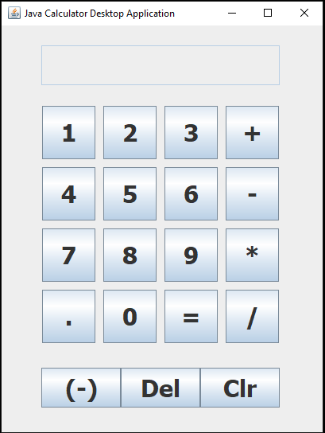

</a>

# Java Calculator Desktop Application

# Table of Contents

- [Java Calculator Desktop Application](#java-calculator-desktop-application)
- [Table of Contents](#table-of-contents)
- [Screenshots of the Application](#screenshots-of-the-application)
- [Description](#description)
- [System requirements](#system-requirements)
- [Packages used](#packages-used)
- [Source Code](#source-code)
- [Running the application as an executable](#running-the-application-as-an-executable)

---

# Screenshots of the Application

 

# Description

A simple application implement mathematical operations on a GUI interface which uses java.awt; java.awt.event; javax.swing; (JFrame, Swing)

Application is wrapped as an executable application (.exe) using Launch4j and ready to go.

# System requirements

- JavaSE-1.8 or higher.

# Packages used

- import javax.swing.\*
- import java.awt.\*
- import java.awt.event.\*

# Source Code

This project was developed in Eclipse IDE and uploaded as an Eclipse project for convenience.

- Source code is available to view in the src folder
- Compiled code located in the bin directory.
- Jar File
- Executable (.exe) File
- Doc's file (javadocs)

# Running the application as an executable

As the project has already been compiled into an executable file, all you need to is:

- Download the project and run Java Calculator Desktop Application.exe
- All other files are not required unless you wish to inspect the source code and documentation.
